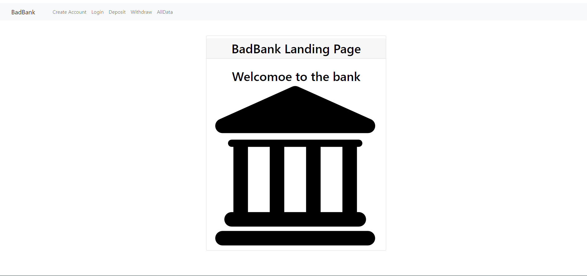
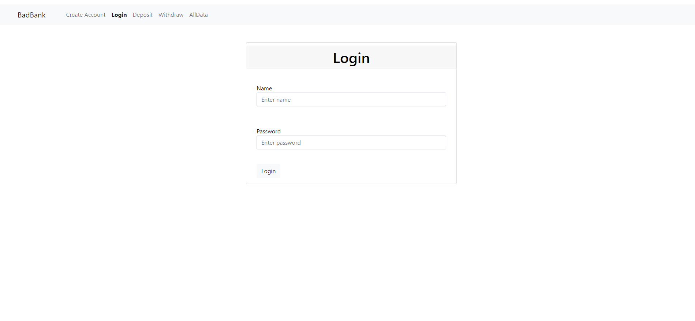
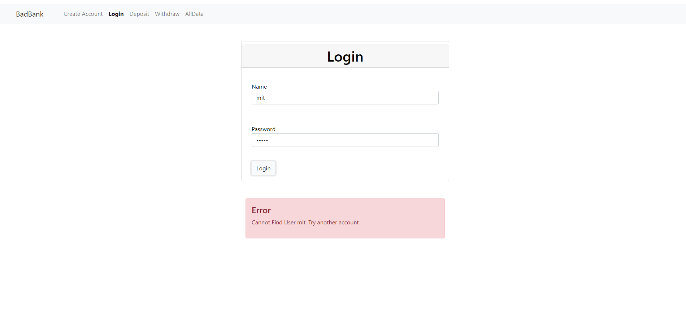
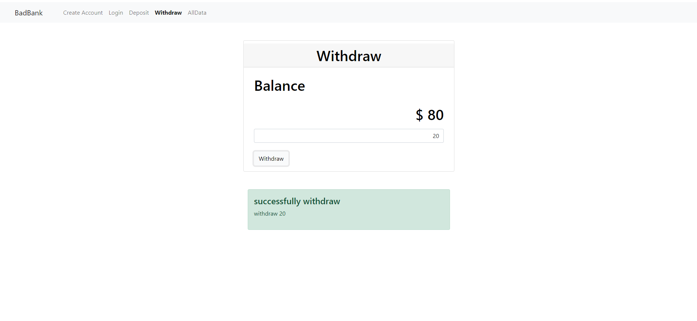

# BadBank

<div>
 
</div>
<div>
 
</div>
## Description:
  
  
## Installation:
 
  3. 
     ```console
     npm install --global http-server
     ```
  4. Type **npm install**.
     ```console
     npm install
     ```
  5. 
     ```console
     
     ```
  6. 

  
## Usage:
**[AWS page](https://kojiro-asanobankingapplication.s3.amazonaws.com/index.html)**
  
## Support:
  If any question, message me via **[my twitter](https://twitter.com/Kojiro38895598)**.
  
## Roadmap:

  
## License information: 

 
